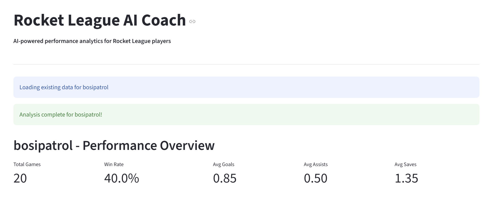
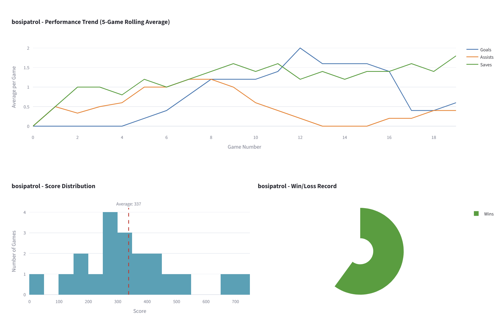
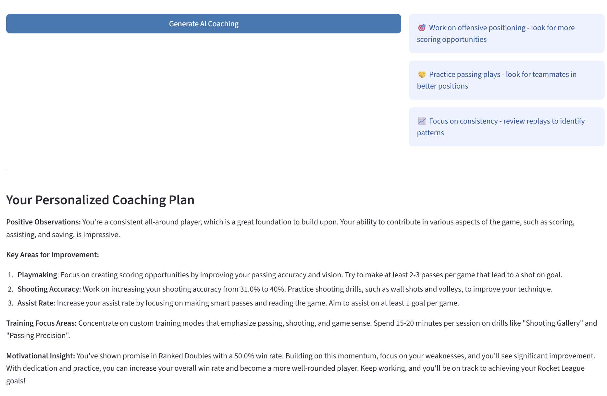

# 🚀 Rocket League AI Coach

AI-powered performance analytics for Rocket League players using real-time data and machine learning.


## 🌐 Live Demo

**[Try it live here!](https://rocket-league-ai-coach.streamlit.app/)**

## 📊 Features

- **Real-time Data Collection** - Fetches player statistics from Ballchasing.com API
- **Performance Analytics** - Calculates trends, averages, and improvement metrics
- **Interactive Visualizations** - 6+ interactive charts with Plotly
- **AI-Powered Coaching** - Personalized tips using Groq's Llama 3.1 AI
- **Game Mode Analysis** - Stats broken down by playlist (1v1, 2v2, 3v3)
- **Improvement Tracking** - Compare recent vs historical performance

## 🛠️ Tech Stack

- **Frontend:** Streamlit
- **Data Visualization:** Plotly
- **AI/ML:** Groq API (Llama 3.3)
- **Data Processing:** pandas, NumPy
- **Database:** SQLite
- **APIs:** Ballchasing.com, Groq

## 📸 Screenshots

### Dashboard Overview


### Performance Trends


### AI Coaching


## 🚀 Quick Start

### Prerequisites

- Python 3.10+
- Ballchasing API key ([Get one here](https://ballchasing.com))
- Groq API key ([Get one here](https://console.groq.com))

### Installation

1. Clone the repository
```bash
git clone https://github.com/YOUR_USERNAME/rocket-league-ai-coach.git
cd rocket-league-ai-coach
```

2. Install dependencies
```bash
pip install -r requirements.txt
```

3. Create `config.py` with your API keys
```python
BALLCHASING_API_KEY = "your_key_here"
GROQ_API_KEY = "your_key_here"
```

4. Run the app
```bash
streamlit run app.py
```

5. Open your browser to `http://localhost:8501`

## 📖 How It Works

1. **Data Collection** - Users enter a player name, and the app fetches their match history from Ballchasing.com
2. **Analytics Processing** - Calculates performance metrics, trends, and identifies strengths/weaknesses
3. **Visualization** - Generates interactive charts showing performance over time, by game mode, etc.
4. **AI Coaching** - Sends stats to Groq's Llama 3.1 model which generates personalized coaching advice

## 🎯 Use Cases

- **Players** - Track your own improvement and get personalized coaching tips
- **Coaches** - Analyze your team's performance and identify areas for improvement
- **Content Creators** - Generate stats and insights for videos and streams
- **Data Enthusiasts** - Explore Rocket League performance data

## 📊 Project Structure
```
rocket-league-ai-coach/
├── app.py                      # Streamlit dashboard
├── config.py                   # API keys (gitignored)
├── requirements.txt            # Python dependencies
├── src/
│   ├── data_collection.py     # Ballchasing API integration
│   ├── database.py            # SQLite database management
│   ├── analytics.py           # Performance calculations
│   ├── visualizations.py      # Plotly charts
│   └── ai_coach.py            # AI coaching with Groq
└── data/                      # Local database (gitignored)
```

## 🔑 Environment Variables

For deployment, set these secrets:

- `BALLCHASING_API_KEY` - Your Ballchasing API key
- `GROQ_API_KEY` - Your Groq API key

## 🚧 Future Enhancements

- [ ] Add text-to-speech for voice coaching
- [ ] Real-time game analysis during matches
- [ ] Player comparison mode
- [ ] Rank prediction based on stats
- [ ] Training pack recommendations
- [ ] Discord bot integration

## 📝 License

This project is licensed under the MIT License - see the LICENSE file for details.

## 🙏 Acknowledgments

- Data provided by [Ballchasing.com](https://ballchasing.com)
- AI powered by [Groq](https://groq.com)
- Built with [Streamlit](https://streamlit.io)

## 👤 Author

**Ezra Gonzalez**
- GitHub: [ERGonzalez-stu](https://github.com/ERGonzalez-stu)

## 📧 Contact

Questions? Reach out at ezra.rider.gonzalez@gmail.com

---

⭐ **Star this repo if you found it helpful!**